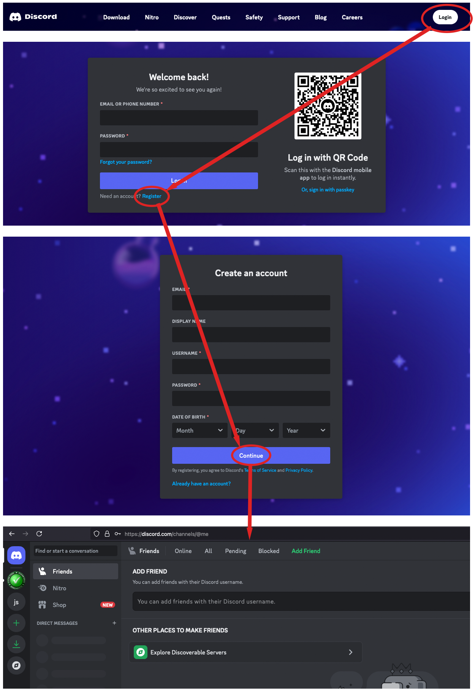

[//]: # (about.md)
[//]: # (Copyright © 2024 Joel A Mussman. All rights reserved.)
[//]: #

Clean Coders Collaborative moved to Discord to minimize zoom-bombing but a lot of other
advantages have presented themselves, one of which is the combination of video conferencing
and anytime chat in one tool!

## Already Got Discord?

* [Server invite link](https://discord.gg/epKjpZA3)
\(Click this link to add our server to your account)
* [Direct link to meetup channel](discord://discord.com/channels/1080153218899787856/1080153220137107466)
\(If you have the server added click here to join the meetup)

# Get Started with Discord

You need to have a *FREE* Discord account to join our collaboration meetups.
Asking our members to have an account reduces the zoom-bombing we experience.
Discord is also extremely popular for both gaming and business, so it is real collaboration tool
(in case you are not familiar)!

To create an account just visit [https://discord.dom](https://discord.com), click the Login button, and on the next page
click the link to register.
If you already have an account, skip to [Joining our Discord Server](#joining-our-discord-server).

Our meetups will work with the browser interface, but you can also download and use
the desktop application.

# Joining our Discord Server

At Discord text and video chats are organized under *servers*.
After adding our server to your account you will pass through the *onboarding* process with a few steps to introduce our environment.

* [Server invite link](https://discord.gg/epKjpZA3)
\(Click this link to add our server to your account)
* [Direct link to meetup channel](discord://discord.com/channels/1080153218899787856/1080153220137107466)
\(If you have the server added click here to join the meetup)