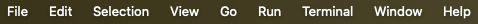
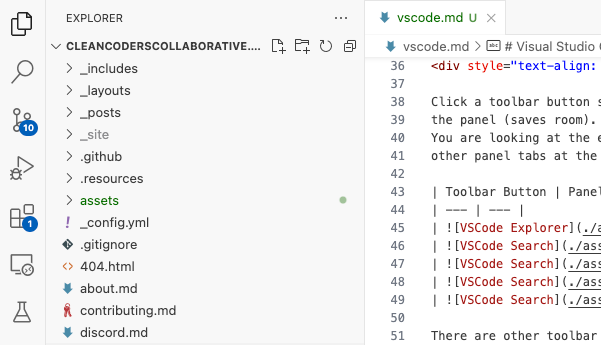
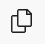
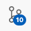
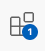
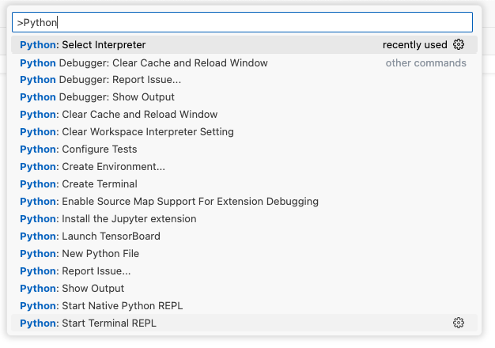
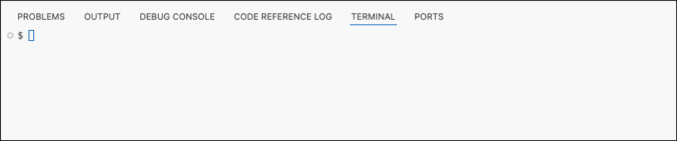
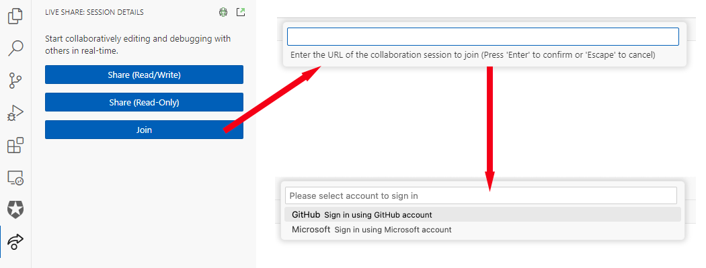
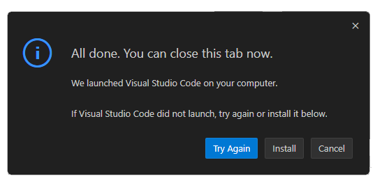
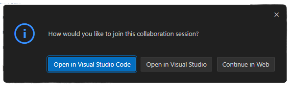

[//]: # (about.md)
[//]: # (Copyright © 2024 Joel A Mussman. All rights reserved.)
[//]: #

## Visual Studio Code

If you already know Visual Studio Code, follow this link
[to learn about how we use the Microsoft Live Share](#live-share)
for collaboration.

Microsoft Visual Studio Code (VSCode) has become an exceptionally popular integrated
development environment (IDE).
VSCode is fundamentally a huge single-page application; it is written in TypeScript and
runs in the chromium browser with all the decorations like the address bar removed.
That creates a huge advantage because it can actually run in a browser, which is how
it works in your regular browser as the front-end to GitHub Codespaces.

This is an over-simplification of the implementation, if you really want the gory details check out this
[blog post by Bengamin Pasero](https://www.git-tower.com/blog/developing-for-the-desktop-vscode/). 

### General Use

This is just a quick tour of VSCode for the purposes of working in our sessions.
There is plenty of online documentation and there are tutorials to learn how to use the IDE.
VSCode pretty much follows the structure of all IDEs, so you know there will be a debugger and unit tests
and code coverage, etc.

#### Menu

VSCode has the expected application menu.
Note: when VSCode is in a regular browser, the menu moves from the normal application location to
a "hamburger" menu at the top of the toolbar above the explorer icon:

#### Appearance

VSCode has multiple themes, and can track light and dark modes on your computer.
On Microsoft Windows use the menu option *File &rarr; Preferences &rarr; Theme &rarr; Color Theme* to select a theme.
On the Mac use *Code &rarr; Settings... &rarr; Theme &rarr; Color Theme*.

#### Toolbar
The toolbar can be positioned at the left or right, and shows different panels next to the toolbar
for each of the buttons:

Click a toolbar icon switches to that panel, clicking the icon for the current panel closes
the panel to save room.
You are looking at the explorer view, which shows the folders and files in the open project folder and may have
other panel tabs at the bottom.

| Toolbar Icon | Panel |
| --- | --- |
|  | Explorer: the folder and file tree, and other things |
|  | Search across files in the project folder |
|  | Manage source-control (the badge is files added or changed) |
|  | Run or debug the application |
|  | Manage VSCode extensions (the badge is extensions to update) |

There are other toolbar buttons in the example above, those represent extensions that have been added to VSCode
(the next subject).

#### Extensions

VSCode is fully extensible by the community.
Extensions may be written by anyone and added to the marketplace, where you can add them to your copy of VSCode.
This allows VSCode to work with any programming environment or tools like source-control systems,
by virtue of creating an extension for them.
And of course it makes it easy to integrate and future lanugages, environments, or tools.

Many (but not all) extensions will add a toolbar icon and panel for their purpose.
Some, like Microsoft's Python Debugger, will integrate with an existing panel like *run and debug*.

The extension toolbar icon allows you to add and remove extensions from the marketplace.

#### Commands

Everything in VSCode is handled by executing a command, even when you choose a menu item or click an icon/button.
The *File &rarr; Open* menu runs a command.
Clicking start in *Run and Debug* runs a command to launch the program.
All of the commands are accessible and may be run from the command palette,
which may be opened from the *View &rarr; Command Palette...* menu option or with
ctrl/cmd-p.

The command palette is searchable, just start typing the command group and name.
Extgensions that are added, like Microsoft's Python extension, will typically add commands to the palette:

#### Edit Window

The big window of of course is where code can be edited.
Use ctrl/cmd-f to open the search popup, and alt-ctrl/cmd-f to open the search and replace popup.

#### Miscellaneous

Below the edit window you may see a set of tabs.
If this panel is not showing, opening any of the views with a dedicated menu option or
the *View &rarr; Open View...* menu will cause it to appear.
For example, use the *View &rarr; Terminal* menu option to show the terminal (command prompt) tab:

Other than *Ports* the other tabs do pretty much what their names say: *Problems* are issues found
in the code, *Output* is output from running a program, etc.
The *Ports* tab is used to control what TCP/IP ports an application presents to the system
when running in a container, like the Docker containers used by GitHub Codespace.

### Live Share

The Microsoft *Live Share* extension is used for collaboration.
Multiple people can view and possibly edit the files in a project simultaneously.

Live Share works through a server in the cloud, and that server requires you to authenticate.
There are two choices: authenticate with your GitHub account, or with a
Microsoft cloud account.

The host will provide a URL for you to use to join the Live Share session.

#### Join in VSCode

The smoothest way to join a Live Share session is to click the Live Share icon in the toolbar,
click *Join*, and paste in the URL.
If you are not already signed in to the Live Share server, you will be prompted to log in
with your GitHub or Microsoft account:

#### Join from a Browser

If click the URL and it opens in a browser, the behavior is different depending on the browser.
If you do not have VSCode installed locally, they will all allow you to join by launching
VSCode in the browser.

If the link opens in Chrome and VSCode is installed, it will force you to switch to the desktop
version:

If the link opens in Microsoft Edge or Firefox, you will be presented with a choice to open
VSCode in the browser or open the desktop application:

Notes:
1. If you are not signed in to the Live Share server, you will be prompted to sign in.
1. The previous dialog reveals that Live Share will work with regular Visual Studio if you choose to go that route.

### Etiquette

Live Share allows you to browse and open any of the files in the project, not just what the
host is looking at.
Multiple users can edit at the same time, even simultaneously in the same file.
So to keep everything organized:

1. Remember you are working on the host's copy of the project, not your own.
Be considerate of their computer.
1. We will virtually pass an "editing stick", which is like a "talking stick" in a meeting; only the
user with the editing stick should make changes.
1. To stress this: do not go behind the user editing and modify other files in the project that
nobody else is looking at.
1. Whoever has the *editing stick* will announce what file they are working in,
so you can switch to that in your own view and follow along.

#### Good luck and welcome to the team!